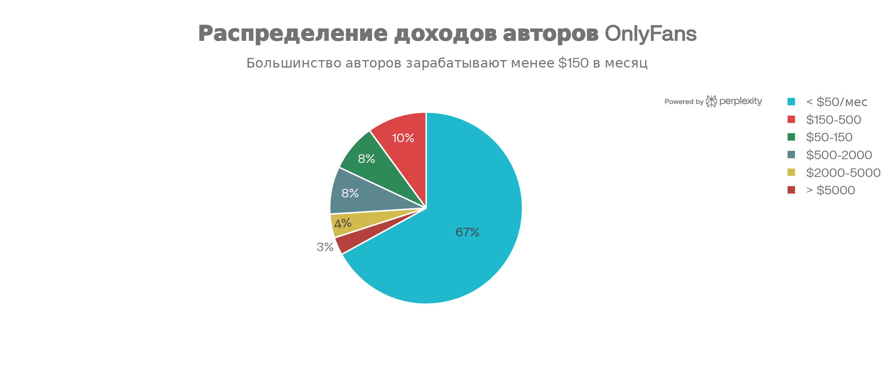
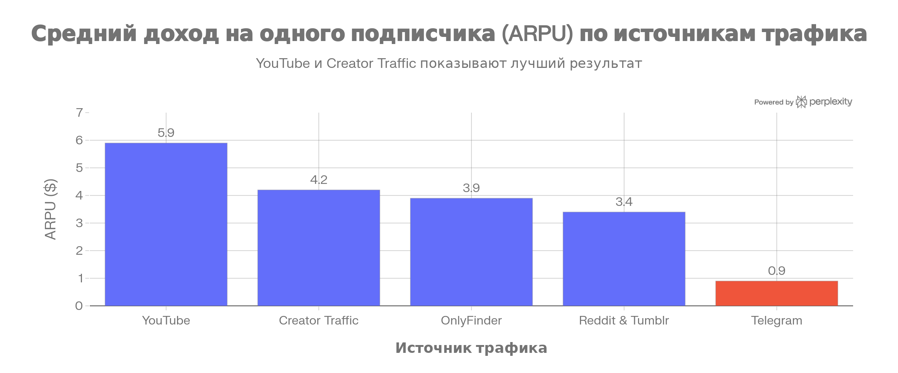
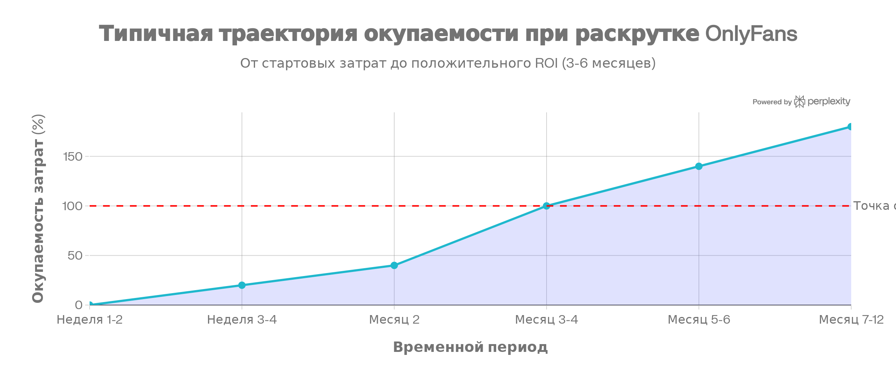

# онлик и вся хуйня

---

## 1. OnlyFans vs Boosty

**OnlyFans** -глобальная платформа с 305+ млн пользователей и 4.11 млн создателей. Комиссия 20%, но огромная аудитория. Проблема для россиян: блокировка и сложности с выводом денег.

**Boosty** - русская альтернатива. Комиссия всего 7%, легальна в России, вывод на РФ карту. Аудитория растет, но меньше глобальных пользователей.

Если начинать в РФ, то лучше с Бубсти затем докинуть онлик параллельно.

## 2. Где какать?

По данным за 2025 год на OnlyFans:

- **Фото** - 75% успешных авторов (самый популярный формат)
- **Видео** - 2-й по популярности, на долгосрок
- **Живые трансляции** - такое тоже есть, но для совсем топов. Обычные мимокроки мало кому нужны. Либо наоборот, очень локальная штука, типа эксклюзивых сессий с подписотой, совместного просмотра кинца и тд
- Сторис - это туба шобы ебало примелькалось и постоянно ыбло на виду.

Содержание должно быть смешанным: от полностью откровенного контента до более скромных кадров. Сюжетные видео с прогрессией работают лучше одиночных кадров.

Эксклюзивный контент разных уровней подписки, закрытые чаты, бэкстейджи и прочий неформат тоже иногда заходит. Но если люди пришли за фотками жопы, то лучше ее не прятать. В идеале иметь пару прогревочных постов, где можно чутка очком подмигнуть, но без жести, так чел хотя бы поймет, что не подписывается на хуйню либо не будет делать рефанд, когда увидит, что за блюром нихуя интересного нет. Фотки ваших котов и собак на бусти никому не нужны. Либо жопа + лайфстайл + что-то, чем хочется, либо просто жопа. Другого не дано. 

## 3. А как какать?

Схема примерно такая:

**Тикичи (на старт, 3-4 недели)**

- Косплей, танцульки, любая трендовая параша, главное себя показать
- Популярный музон тоже важен
- Намеки на контент, но без наготы, чтобы алгоритмы не дали хуяку пососать
- Набивать 5-50к просмотров
- Ссылка в профиле на инсту или линктри (где все соц сеточки)

 **Рислы в инсте (конвертация, 2-3 недели)**

- Перезаливка залетевших тиктоков
- Ссылка на био, в био ссылка на бусти/оф
- Тут можно чутка жопу или ножки светануть, инста лояльнее
- Набить 10-100к фолловеров

Телега. Твиттер и реддит (опциональо)

- Твиттер -эьо если есть таргет на зарубежную аудиторию, там можно постоить какие-то фоточки и видосики, оставить прямые ссылки на онлик. В монетизацию за звезды в телеге я не особо верю, но видел и такое, будто даже аудитория активная есть, особенно студентики без денях в комментах. Норм прикорм
- можно исполнять примерно то же самое, что и в инсте, пока вообще все не заблокировали нахуй. Балансить контент под звездочками и обычный.
- Тизеры, анонсы
- Больше простора для простой болтологии.

**Онлик, бусти** 

- Самый откровенный и эксклюзивный контент
- Прямая и приватная коммуникация с подписчиками. Там можно срать нотификациями, типа “эй, малыш, опустоши свои яйца“, какую-нить такую хуйню.
- Добавить донат гол на след образ/косплей

**Лучшие источники трафика по доходу на подписчика (ARPU):**

- YouTube: **€**5.90
- Creator Traffic: **€**4.20
- OnlyFinder: **€**3.90
- Reddit: **€**3.40
- Telegram: **€**0.90 (худший)

## 4. Скока стоит?

| Айтем | Цена |
| --- | --- |
| Минималка | **€**200-500 |
| светодиодная лампа | **€**50-150 |
| микро или петличка | **€**20-50 |
| штатив и гринка | **€**30-70 |
| **Средний набор** | **€**1,000-2,000 |
| Свет покруче | **€**100-300 |
| Камера б/у | **€**300-600 |
| Фш с плати ру и тд | **€**20/мес |
| **Рекомендуемый стартовый капитал** | **€1,700-4,500** |
| Оборудование | **€**200-500 |
| Платный трафик (месяц 1) | **€**500-2,000 |
| Резерв | **€**1,000-2,000 |

**Текущие ежемесячные затраты:**

- Трафик (эсли покупать): **€**500-5,000
- Софт подписки: **€**10-100
- Замена оборудования: **€**100-300
- **Итого: €610-5,450/месяц**

Для быстрой раскрутки рекомендуется **€3,500** - без этого рост идет очень медленно, потому что может не стрелять, могут дать за щеку алгоритмы и все такое. Если денях меньше - развивать органически (бесплатно и тяжело).

## 5. Чем какать?

**Оптимал:**

- На основной платформе (OF/Boosty) 3-5 раз в неделю
- В ТТ: 3-5 видео в день
- Сторис: 5 в день

**Формат:**

- Фото с сюжетом (лучше одиночных кадров)
- Видео с прогрессией (от скромного к откровенному)
- Трансы 1-2 раза в неделю
- платные посты (конкретный пост за конкретную цену, мимо подписки)
- Интерактив (опросы, вопросы, общение,)

Помнить про хорошее освещение, резкие кадры, естественные цвета. Хуевая картинка снижает конверсию вдвое.

## 6. На сколько шекелей греть гоев?

**На boosty:**

- Базовая: 99 ₽ (первый уровень, максимальный охват)
- Средняя: 299 ₽ (эксклюзивный контент)
- VIP: 999 ₽ (персональное общение)
- Можно еще докинуть 1 лвл за 5к, где пердеть сливками в камеру. Другого придумать не могу
- Пробный период: 30 дней за половину цены

**На OF:**

- Базовая: **€**4.99-9.99 (привлечение объема)
- Средняя: **€**19.99-24.99 (большинство выбирает это)
- Premium: **€**49.99 (это уже для самых топовых модеклей)

**Структура**

- Новички: 50% бесплатного, 30% для подписчиков, 20% эксклюзива (**€**5-15)
- Средний уровень: 30% бесплатного, 40% для подписчиков, 30% эксклюзива (**€**10-50)
- Топовые: 15-20% бесплатного, 35-40% для подписчиков, 40-50% эксклюзива (**€**25-100+)

**Способы увеличить доход:**

1. Пробные периоды: 7 дней бесплатно или за **€**1 (конверсия 30-50%)
2. Сегментация подписчиков: разные уровни цен для разных доходов
3. Сезонные скидки: Новый год, День влюбленных (шобы одинокие мальчики могли представить, что ты их тяночка), день рождения (на 3-7 дней)
4. Эксклюзхиыываный (блять как я заебался это слово писать) контент: тизер в ленте, полная версия за доплату

## 7. Окупится?

Да я хуй пойму, но можно предположить:

**По данным OnlyTraffic (анализ 1 млн пользователей):**

- **3-6 месяцев:** 114% окупаемость
- **6-12 месяцев:** 141% окупаемость
- **меньше 3 мес - нереально**

**Ссроки по этапам:**

- До первых подписчиков: 2-4 недели при активной раскрутке
- До первого дохода: 4-8 недель
- До 50-100 подписчиков: 2-3 месяца
- **До окупаемости затрат: 3-6 месяцев**
- До стабильного дохода: 6-12 месяцев

**Математика для двух сценариев:**

| Сценарий | Месяц 1 | Месяц 2 | Месяц 3 | Месяц 4 | Месяц 5-6 |
| --- | --- | --- | --- | --- | --- |
| **Минимальный (€500 инвест)** | **€**50, ROI -90% | **€**200, ROI -60% | **€**400, ROI -20% | **€600, ROI +20%** | **€**1-2K, ROI +100-300% |
| **С платным трафиком (€3K инвест)** | **€**800, ROI -73% | **€**1.5K, ROI -50% | **€3K, ROI 0%** | **€**4K, ROI +33% | **€**5-8K, ROI +66-166% |

Натуральный  рост дольше, но дешевле. С платным трафиком быстрее, но требуется начальный бабос на раскрутку. 
РОИ? Че такое **РОИ** ДИБИЛ ЕБАНЫЙ БЛЯТЬ? А я отвечу: рентабельность, соотношение прибыли к вложениям.

## 8. Статка

На прошлый год

- **67%** авторов зарабатывают **менее €50/месяц**
- **8%** авторов: **€**50-150/месяц
- **10%** авторов: **€**150-500/месяц
- **8%** авторов: **€**500-2,000/месяц
- **4%** авторов: **€**2,000-5,000/месяц
- **3%** авторов: более **€**5,000/месяц
- **< 0.5%** авторов: более **€**1,000,000/год

**Среднее распределение:**

- Медианный доход: **€**100-150/месяц
- Среднее арифметическое: **€**180-350/месяц
- Большинство авторов: **менее €150/месяц**

**Реальные примеры заработков:**

- Начинающая с аудиторией: **€**300-1,000/месяц
- Среднего уровня (5-20k подписчиков): **€**1,000-5,000/месяц
- Успешная (20-100k подписчиков): **€**5,000-20,000/месяц
- Топовая (100k+ подписчиков): **€**20,000-100,000+/месяц
- Парная контента (OnlyFans + Fansly): **€**5,000-7,000/месяц

Эти цифры показывают, что большинство зарабатывает копье ебучее. Успешного успеха гораздо меньше, чем нам пытаются навязать в интернете. Думаем

## 9. Но я хочу…

**Ну я хуй знает тада, терпим, придерживаемся правил:**

1. **Качество контента-**  хорошие фотки и видосы 
2. **Частота публикаций** - 6+ раз в неделю, срать регулярно и не пропадать
3. **Общение с адутиорией** - ответы на сообщения быстро, речь о сабах платных. На обычных гоев поху
4. **Уникальность** - можно заморочиться и придумывать свое, образы, темки, сюжеты. Но на первой точно лучше пиздить удачное у других, приукаршать блестками и выдавать за свое. Иначе выгорание произойдет моментальное
5. **Разнообразие форматов**- это спороно. Кому-то могут заходить только сиськи и жопы, а кто-то готов наворачивать вообще все и занюхивать каждый пук. стоит подстраиваться под аудиторию
6. **Таргет** нужен целеовй, а не кто попало. 
7. **Кросспостинг** по всем соц сеткам

**что делать не надо:**

- Постить хуйню
- проебывать
- Игнорировать шейхов и платных сабов
- Наглеть и завышать цены
- Безыдейная халтура
- Не раскручиваться и не пиариться

## 10. Планчик

**Неделя 1:** регнуть акки, настроить оборудование, настроить профили, уровни подписки, снять материала на 10-20 постов

**Неделя 2-3:** Запустить бустик или онлик, можно оба (5 постов), в ТТ насрать видосами, в интсе насрать рилсами (штук 5-10)

**Месяц 1:** щитпостить 5-10 раз в неделю, отвечать на ВСЕ сообщения, желательно пораньше, можно подрубать трансляции, потестить цены и пробники.

**Месяц 2-3:** чекать статку, фидбек по постам, по форматам, лишнее убрать, хрошее добавить,, если гои греются, то можно чутка поднять цену, процентов на 20, запустить платную рпекламу (**€**100-500 в неделю), докинуть 3-5 уровни подписьки

**Месяц 4-6:** Уувеличивать трафик, коллабиться, мутить что-то уникальное, постинг и съемка контента уже должны быть, как привычка завтракать, следить за статкой. 

---

**Типичная траектория доходов:**

- Месяцы 1-2: **€**0-200/месяц (период нулевой окупаемости)
- Месяцы 3-4: **€**200-1,000/месяц
- Месяцы 5-6: **€**1,000-3,000/месяц (**окупаемость затрат**)
- Месяцы 7-12: **€**2,000-10,000+/месяц (если все ок)

⁂ ссылки на всякое

---

1. https://yandex.kz/yanswers/c/tehnologiyalar/q/kakie-kategorii-kontenta-populyarny-na-onlyfans-3601928767[↩︎](about:blank#fnref1)
2. https://spicyai.tech/ru/newsroom/идеи-контента-для-onlyfans-как-привлечь-подписчиков[↩︎](about:blank#fnref2)
3. https://boosty.to/boosty/posts/7618e806-5a70-4c84-b00d-1daf28acb5e4[↩︎](about:blank#fnref3)
4. https://fb-killa.pro/threads/onlyfans-agenstva-skolko-mozhno-zarabotat-i-kakie-est-slozhnosti-udachnyj-i-provalnyj-kejsy-ot-ovnera-i-trafik-menedzhera-v-intervju.22417/[↩︎](about:blank#fnref4)
5. https://yandex.kz/yanswers/c/tehnologiyalar/q/kakie-kategorii-kontenta-populyarny-na-onlyfans-3601928767[↩︎](about:blank#fnref5)
6. https://spicyai.tech/ru/newsroom/идеи-контента-для-onlyfans-как-привлечь-подписчиков[↩︎](about:blank#fnref6)
7. https://slobodskyi.com/ru/monetize/memberships/onlyfans[↩︎](about:blank#fnref7)
8. https://blog.octobrowser.net/ru/kak-zarabotat-na-onlyfans[↩︎](about:blank#fnref8)
9. https://slobodskyi.com/ru/monetize/memberships/onlyfans[↩︎](about:blank#fnref9)
10. https://fanspicy.com/insights/ru/what-percentage-does-onlyfans-take/[↩︎](about:blank#fnref10)
11. https://boosty.to/boosty/posts/7618e806-5a70-4c84-b00d-1daf28acb5e4[↩︎](about:blank#fnref11)
12. https://boosty.to/boosty/posts/2785d492-4e8c-4cf4-9734-bec2fa184374[↩︎](about:blank#fnref12)
13. https://t-j.ru/friendship-ended-with-patreon/[↩︎](about:blank#fnref13)
14. https://www.mentoday.ru/life/news/24-05-2025/analitiki-ravzeyali-mif-o-bolshih-dohodah-na-onlyfans-2-mln-jenshchin-na-platforme-poluchayut-menshe-4000-rublei-v-mesyac/[↩︎](about:blank#fnref14)
15. https://dtf.ru/kontent_creators/3388670-skolko-zarabatyvayut-modeli-na-onlyfans-osnovnye-fakty-i-statistika[↩︎](about:blank#fnref15)
16. https://pleazeme.com/onlyfans-statistics/[↩︎](about:blank#fnref16)
17. https://blog.octobrowser.net/ru/kak-zarabotat-na-onlyfans[↩︎](about:blank#fnref17)
18. https://www.unfiltered-management.com/ru/blog/only-fans-income[↩︎](about:blank#fnref18)
19. https://www.unfiltered-management.com/ru/blog/how-to-start-onlyfans[↩︎](about:blank#fnref19)
20. https://vc.ru/creator_contenta/490114-media-kochevniki-o-prodvizhenii-onlyfans-cherez-drugie-servisy[↩︎](about:blank#fnref20)
21. https://onlyfansagency.com.ua/skolko-mozhno-zarabotat-na-onlyfans/[↩︎](about:blank#fnref21)
22. https://partnerkin.com/blog/articles/onlyfans_raskrutka[↩︎](about:blank#fnref22)
23. https://vc.ru/490114[↩︎](about:blank#fnref23)
24. https://up211.com/ru/promotion-onlyfans-tips-for-starters/[↩︎](about:blank#fnref24)
25. https://ecommercefastlane.com/ru/идеи-для-ниши-onlyfans/[↩︎](about:blank#fnref25)
26. https://www.reddit.com/r/onlyfansadvice/comments/1n58o2x/onlyfans_promotional_platforms/[↩︎](about:blank#fnref26)
27. https://partnerkin.com/blog/intervyu/mеn-in-adalt[↩︎](about:blank#fnref27)
28. https://www.internetmatters.org/ru/advice/apps-and-platforms/entertainment/onlyfans/[↩︎](about:blank#fnref28)
29. https://partnerkin.com/blog/stati/best-source-onlyfans-2025[↩︎](about:blank#fnref29)
30. https://www.youtube.com/watch?v=poxHeKa7O4g[↩︎](about:blank#fnref30)
31. https://perfluence.net/blog/article/kak-privlech-podpischikov-boosty[↩︎](about:blank#fnref31)
32. https://cpa.rip/blogs/onlyfans-users-spending-statistics/[↩︎](about:blank#fnref32)
33. https://cpa.live/articles/kak-lit-na-onlyfans/[↩︎](about:blank#fnref33)
34. https://onlytraffic.com/ru/offers[↩︎](about:blank#fnref34)
35. http://perfluence.net/blog/article/kak-privlech-podpischikov-boosty[↩︎](about:blank#fnref35)
36. https://www.reddit.com/r/AskSocialScience/comments/yrv48h/what_percentage_of_paying_onlyfans_users_is_female/[↩︎](about:blank#fnref36)
37. https://hf.ru/c/business_sozdanie_kontenta_na_onlyfans_spons_patreon_boosty[↩︎](about:blank#fnref37)
38. https://www.youtube.com/watch?v=H1wtQHK1LBA[↩︎](about:blank#fnref38)
39. https://vc.ru/marketing/2066963-zarabotok-na-boosty-i-onlyfans[↩︎](about:blank#fnref39)
40. https://www.instagram.com/reel/DMpFv8yodD7/?hl=en[↩︎](about:blank#fnref40)
41. https://www.geelark.com/ru/blog-ru/kak-zarabatyvat-na-onlyfans-polnoe-rukovodstvo-dlya-kreatorov/[↩︎](about:blank#fnref41)
42. https://ru.wikipedia.org/wiki/OnlyFans[↩︎](about:blank#fnref42)
43. https://habr.com/ru/articles/917878/[↩︎](about:blank#fnref43)
44. https://cpa.rip/blogs/onlyfans-on-2024/[↩︎](about:blank#fnref44)
45. https://www.reddit.com/r/onlyfansadvice/comments/15hlprs/beginner_account_review_help_with_gaining_initial/[↩︎](about:blank#fnref45)